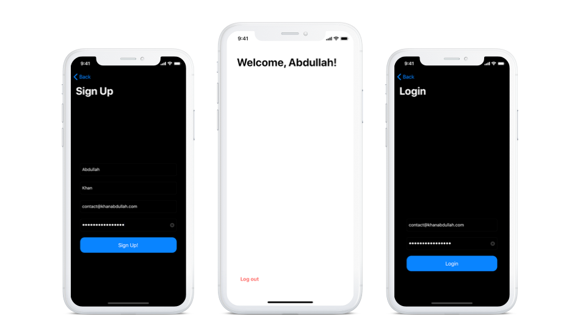

# Firestore-iOS
:key:  An iOS 13 application with Firebase Authentication and Cloud Firestore integration

## Running
1. Clone this repository
2. Get your `GoogleService-Info.plist` file from your Firebase project over at the [Firebase Console](https://console.firebase.google.com)
3. Install dependencies using `pod install`
4. Open the `.xcworkscape` file in Xcode and run the app!
